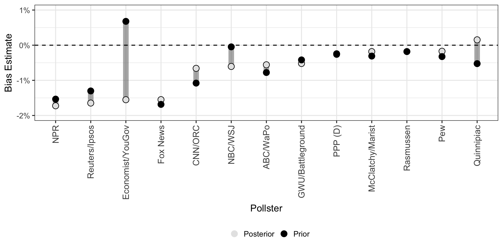
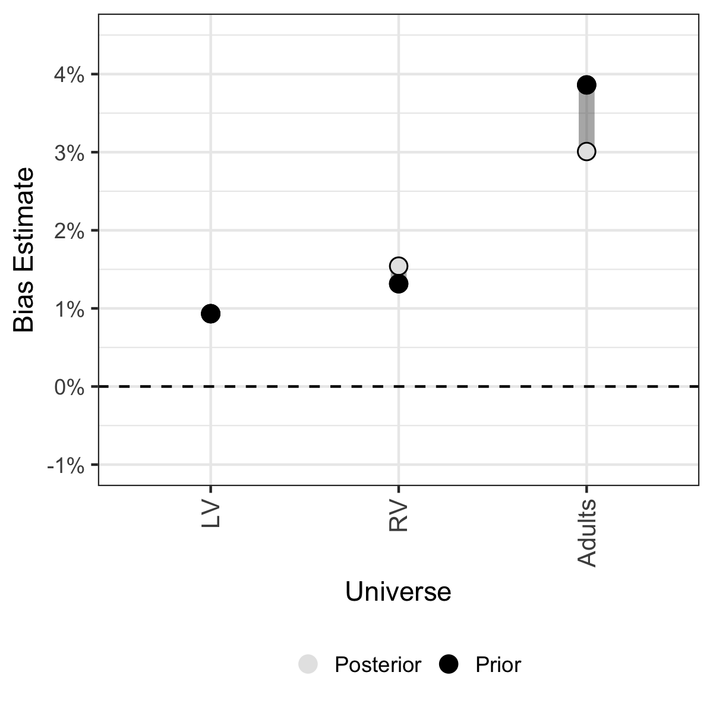

#Pooling the polls to forecast the 2018 US House elections
##Introduction
Using previously estimated pollster and sampling universe biases and current polling data, I forecast the the results of the 2018 US House elections. The Bayesian model predicts Democrats will get 54% of the popular vote, yielding 226 seats in the House of Representatives; current polling suggests there is a 55% chance Democrats will take back the House, on Election Day. Lastly, I apply a uniform swing from 2016 to identify key swing districts for investment in 2018. 

##Data
The polling data were scraped from Real Clear Politics' database for the [__2018__](https://www.realclearpolitics.com/epolls/other/2018_generic_congressional_vote-6185.html#polls) Generic Congressional ballot. Each pollster has a slightly different wording (and hence why we measure pollster bias), but they are all similar to: 'If the elections for the U.S. House of Representatives were being held today, which party’s candidate would you vote for in your congressional district: The Democratic candidate or the Republcian candidate?'  The named Congressional ballot question would account for incumbency effects and more closely mirror the choice voters are making in the voting booth. However, since not all candidates are known for 2018 yet, this is the most common question being polled by public sources. 

Only polls where the year, date range, pollster, sampling universe and sample size are all known were included. Additionally, the polls' results were transformed to reflect the two-way share for Democrats (Dem/(Dem+Rep)): it is a proportion between 0 and 1. Time is transformed to be the rounded number of weeks between the middle day of the poll and election day. A daily model would be more precise, but would take more data. Additionally, only sampling universes and pollsters who have polled in at least one of the last six election cycles are included. This is because I use estimates of bias observed over the last electios to account for house effects. See more [__here__](https://github.com/nickahamed/BSTM/blob/master/proj/pollster_bias.html).

As of 2/3/2018, 102 polls from 13 pollsters contacting 127k respondents were used. These are the 5 largest pollsters. See Appendix B for full details.

<center>
{ width=6in }
</center>

2016 US House election results were taken from [__here__](https://github.com/Prooffreader/election_2016_data).

##Week-by-week estimate of support
I use a Bayesian random-walk model to estimate the true level of support over time. Below, I show that model. Based on the most current data, the forecast gives Democrats 54.1% support on the generic ballot, translating to 226 seats in the House of Representatives. Likewise, there is relatively little volatility in week-to-week movements. Whereas in the past six election cycles, 95% of week-to-week movement was within 1.5pp, this cycle, 95% of movement is within just 0.66pp. We saw a maximum amount of support for Democrats right at the end of 2017, possibly associated with XXX event, but there's been a slight return since. 

<center>
{ width=8in }
</center>

If the election were held today, there is a 100% chance that Democrats win over 50% of the popular vote, and more importantly, there is nearly a 100% chance that they win a majority of seats in the House itself. Accounting for the variation we expect over time, there is still a 62% chance Democrats will win 50% of the popular vote and a 55% chance of winning a majority of seats __on election day__.

##Strategic targeting for 2018
Following [__Jackman (2014)__](https://www.cambridge.org/core/services/aop-cambridge-core/content/view/S1049096514000109), I apply a national uniform swing to the 2016 two-way results of each Congressional district to identify key districts for targeting. 33 districts have at least a 40% chance, but no more than a 60% chance of being won on election day, based on the national swing. 4 are in each of Florida and California, and 3 are in Pennsylvania. 


<center>
{ width=8in }
</center>

##Updated pollster and universe bias
</center>
{ width=8in }
</center>

</center>
{ width=8in }
</center>

#Appendix A
To specify my random walk model, I follow [__Jackman (2005)__](http://eppsac.utdallas.edu/files/jackman/CAJP%2040-4%20Jackman.pdf). A given poll is assumed to be normally distruted with support as the mean and the standard deviation a function of $y_i$ and sample size. This would be specified as:
$$y_i \sim \mathcal{N}(\mu_i, \sigma^2_i)$$
That poll is centered around mean $\mu_i$, which itself is a function of $\alpha_t$, the true value of support at the time the poll was taken $t$, $\delta_j$, the bias of pollster $j$, and $\theta_k$, the bias of sampling universe $k$. Fully specified, this is: 
$$\mu_i = \alpha_{t_i} + \delta_{j_i} + \theta_{k_i}$$
Due to the trends we see in our initial data exploration, a random walk model is appropriate. In such a model, support at time $t$ is normally distributed around support at time $t - 1$. 
$$ \alpha_t \sim \mathcal{N}(\alpha_{t-1}, \omega^2) $$
For these given specifications, we start with the following priors: 
$$ \sigma^2_i = \frac{y_i(1-y_i)}{n_i},\ \ \ \alpha_1 \sim \mathcal{U}(0.46, 0.56),\ \ \ \omega \sim \mathcal{U}(0, (0.02/1.96))$$
$\sigma^2_i$ just follows the formula for variance of a sample. As a prior for the starting true value of support ($\alpha_1$), I use a uniform distribution over the minimum and maximum actual vote share of Democrats in the six elections analyzed. Lastly, as a prior for the true standard deviation ($\omega$), I use a uniform distribution between 0 and 0.01. A value of 0.01 would reflect that 95% of week-to-week movement is within about 2pp in either direction, a fairly weak assumption. These priors are similar to [__Strauss (2007)__](http://www.mindlessphilosopher.net/princeton/strauss_reverse%20random%20walk.pdf) 

Unlike [__Jackman (2005)__](http://eppsac.utdallas.edu/files/jackman/CAJP%2040-4%20Jackman.pdf) and [__Strauss (2007)__](http://www.mindlessphilosopher.net/princeton/strauss_reverse%20random%20walk.pdf), I have strong priors for $\delta_j$ and $\theta_k$. Whereas they use a weak prior centered around 0, I use the best estimate from past election cycles and the observed uncertainty about that estimate. See more about the estimation of those [__here__](https://github.com/nickahamed/BSTM/blob/master/proj/pollster_bias.html), including the original priors and observed posteriors. However, using priors for all of the variables leaves the model underspecified. It is impossible to simultaneously estimate the bias for universe/pollster, and the true level of support each week. As such, I fix the prior for the pollster/universe that we have the least uncertainty about at it's bias estimate (set variance of prior = 0). Whereas past bias estimates were derived in relation to the true election result, this approach updates the priors in relation to this pollster/universe.

#Appendix B
##Load packages, functions and other setup 
```{r, message=FALSE, warning=FALSE}
library(ggplot2)
library(tidyverse)
library(rjags)
library(cowplot)
library(flextable)

source("forecasting_functions.R")

set.seed(102)
scipen=9
```

##Load, prep and explore data
```{r, message=FALSE, warning=FALSE}
pollster_lkup <- read.csv("data/pollster_lkup.csv")
deltas <- read.csv("data/final_pollster_bias_ests.csv")
thetas <- read.csv("data/final_universe_bias_ests.csv")
coefs <- read.csv("data/forecast_seats_coefs.csv")
past_final_est <- read.csv("data/final_est_comparison.csv")

house_2016 <- read.csv("data/house_general_election_2016.csv") %>%
  filter(individual_party %in% c("republican", "democrat")) %>%
  group_by(state, geo_name, individual_party) %>%
  mutate(vote_pct = ifelse(is.na(vote_pct), 100.0, vote_pct)) %>%
  summarise(vote_pct = sum(vote_pct)) %>%
  ungroup() %>%
  spread(key=individual_party, value = vote_pct, fill = 0) %>%
  mutate(twoway_vote = democrat/(democrat+republican))

polls <- read.csv("data/2018_polling.csv") %>%
  filter(pollster %in% pollster_lkup$pollster) %>%
  mutate(twoway = dem/(dem+rep)) %>% 
  mutate(week = round(as.numeric((as.Date(as.character("11/6/18"),  format="%m/%d/%y") - 
           as.Date(as.character(end_date),  format="%m/%d/%y")) + 
           (as.Date(as.character(end_date),  format="%m/%d/%y") - 
           as.Date(as.character(start_date),  format="%m/%d/%y"))/2)/7),
         n_size = as.numeric(as.character(n_size)))

polling_summary <- polls %>% 
  group_by(pollster) %>%
  summarise(`Total N-Size` = sum(n_size), 
            `# of Polls` = n()) %>%
  arrange(desc(`Total N-Size`)) %>%
  inner_join(pollster_lkup, by = "pollster") %>%
    mutate(pollster_raw = factor(pollster_raw, levels = pollster_raw[order(`Total N-Size`)]))

polling_summary_ft <- polling_summary %>% 
  mutate(nsize = as.character(`Total N-Size`),
         polls = `# of Polls`) %>%
  select(pollster_raw, nsize, polls)

FT1 <- flextable(polling_summary_ft)
FT1 <- set_header_labels(FT1, pollster_raw = "Pollster", nsize = "Total N-Size", polls = "# of Polls")

FT1 <- theme_zebra(x = FT1, odd_header = "#CFCFCF", odd_body = "#EFEFEF",
even_header = "transparent", even_body = "transparent")
FT1 <- align(x = FT1, j = 1, align = "left", part = "all")
FT1 <- align(x = FT1, j = 2:3, align = "center", part = "all")
FT1 <- bold(x = FT1, bold = TRUE, part = "header")
FT1
```

```{r, include=FALSE}
#Plots for above
x1 <- ggplot(data = (polling_summary[1:5,]), aes(y = `# of Polls`, x = pollster_raw)) +
  geom_bar(stat = 'identity') +
  coord_flip() + 
  theme_bw() + 
  xlab("") 

x2 <- ggplot(data = (polling_summary[1:5,]), aes(y = `Total N-Size`, x = pollster_raw)) +
  geom_bar(stat = 'identity') +
  coord_flip() + 
  theme_bw() + 
  xlab("") + 
  theme(axis.text.y = element_blank())

ggsave(filename = "figures/2018_data_breakdown.png", plot = plot_grid(x1, x2, nrow = 1), width = 8, height = 4, units = "in")
```

##Estimate week-by-week movement using past pollster and universe biases
```{r, warning=FALSE, message=FALSE, results=FALSE}
data_jags <- data_prep(data = polls, res = res, year = 2018, anchor = F)
data_jags <- bias_priors(data_jags = data_jags, deltas = deltas, thetas = thetas, anchor = F)

convergence_2018 <- convergence_diagnostics(data_jags = data_jags,
                                            anchor = F,
                                            chains = 4, 
                                            thining = 10, 
                                            burnin = 10000, 
                                            iter = 1000000)

mod_res <- run_model(data_jags = data_jags, 
                     params = c("xi", "omega", "delta", "theta"), 
                     anchor = F,
                     chains = 4, 
                     thining = 10, 
                     burnin = 10000, 
                     iter = 1000000)
cycle_time_est <- extract_time_est(mod_res = mod_res, year = 2018, data_jags = data_jags) %>%
  mutate(time_before_elec = time_before_elec + (max(data_jags$week) - max(data_jags$week_adj)))
omega <- extract_omega_est(mod_res = mod_res, year = 2018, data_jags = data_jags)
```

```{r, include=FALSE}
time_series_with_trend <- ggplot(data=cycle_time_est, aes(x=time_before_elec, y=iter_mean)) + 
  geom_point(data=polls, aes(x=week, y=twoway, size=sqrt(n_size)), alpha=0.2) +
  geom_ribbon(aes(ymin=lower_bound,ymax=upper_bound), alpha = 0.5) +
  geom_line(color = "blue",size = 0.75) +
  theme_bw() + 
  scale_x_reverse(name = "Weeks Before Election", limits= c(94, 0)) +
  scale_y_continuous(name = "Democratic Two-way Vote Share", labels=scales::percent, limits = c(min(0.48, min(polls$twoway) - 0.01), max(0.6, max(polls$twoway) + 0.01))) + 
  guides(size=F, color = F) + 
  geom_hline( aes(yintercept = 0.5), linetype="dashed") 

ggsave(filename = "figures/2018_time_series_with_trend.png", plot = time_series_with_trend, width = 8, height = 4, units = "in")
```

##Predict # of seats won and probability of taking back the House
```{r, warning=FALSE}
message(paste0("Convergance diagnostics for sample 2018 parameters:"))
print(convergence_2018$gelman)
print(convergence_2018$autocorr)

message(paste0("95% CI for week-to-week movement:"))
scales::percent(round(as.numeric(omega)*1.96,4))

##If the election were held today
mod_csim <- as.mcmc(do.call(rbind, mod_res))
mod_csim <- as.data.frame(mod_csim)
final_param <- paste0("xi[",(length(names(mod_csim))-(1+length(unique(data_jags$pollster))+length(unique(data_jags$univ)))),"]")
final_forecast_posterior <- mod_csim[,final_param]

message(paste0("Current forecast of support:"))
scales::percent(round(mean(final_forecast_posterior),3))

message(paste0("Probability of 50% popular vote today:"))
scales::percent(round(mean(final_forecast_posterior > 0.5),3))

predict_seats <- round((coefs[1,1] + coefs[2,1]*mean(final_forecast_posterior))*435)
message(paste0("Number of seats estimated today:"))
predict_seats

final_seats_posterior <- round((coefs[1,1] + coefs[2,1]*final_forecast_posterior)*435)
message(paste0("Probability of a majority of seats today:"))
scales::percent(round(mean(final_seats_posterior > 217),3))


##Adding in error over time
new_means <- rnorm(100000, mean = mean(final_forecast_posterior), sd = (as.numeric(omega)*min(cycle_time_est$time_before_elec)))
new_seats <- round((coefs[1,1] + coefs[2,1]*new_means)*435)

message(paste0("Probability of 50% popular vote on election day:"))
scales::percent(round(mean(new_means > 0.5),3))

message(paste0("Probability of a majority of seats on election day:"))
scales::percent(round(mean(new_seats > 217),3))
```

##Strategic analysis
```{r, warning=FALSE, message=FALSE, results=FALSE}
nat_swing <- mean(final_forecast_posterior) - 
  as.numeric(substr(past_final_est$Popular.Vote[past_final_est$Cycle == 2016],1,4))/100

house_2016$dist_forecast <- house_2016$twoway_vote + nat_swing
house_2016$dist_lb <- house_2016$twoway_vote - 1.96*(as.numeric(omega)*min(cycle_time_est$time_before_elec))
house_2016$dist_ub <- house_2016$twoway_vote + 1.96*(as.numeric(omega)*min(cycle_time_est$time_before_elec))

house_2016$prob_victory <- 0
house_2016$cd <- ""

for (i in 1:nrow(house_2016)) {
  dist_mean <- rnorm(100000, mean = house_2016$dist_forecast[i], sd = (as.numeric(omega)*min(cycle_time_est$time_before_elec)))
  house_2016$prob_victory[i] <- mean(dist_mean > 0.5)
  house_2016$cd[i] <- paste(state.abb[grep(house_2016$state[i], state.name)], strsplit(as.character(house_2016$geo_name[i])," ")[[1]], sep = " - ")
}

house_2016$strat_import <- ifelse(house_2016$prob_victory < 0.6 & house_2016$prob_victory > 0.4, 1, 0)

n_size <- 10000
temp_dists <- data.frame(support = numeric(435), seat = numeric(435))
tipping_point <- data.frame(state = character(n_size), dist = character(n_size), dem = numeric(n_size), stringsAsFactors=FALSE)

for (i in 1:n_size) {
  for (j in 1:nrow(house_2016)) {
    temp_dists$state[j] <- paste(house_2016$state[j])
    temp_dists$dist[j] <- paste(house_2016$geo_name[j])
    temp_dists$support[j] <- rnorm(1, mean = house_2016$dist_forecast[j], sd = (as.numeric(omega)*min(cycle_time_est$time_before_elec)))
  }
  
  temp_dists <- temp_dists %>%
    arrange(-support)
  
  tipping_point$state[i] <- temp_dists$state[218]
  tipping_point$dist[i] <- temp_dists$dist[218]
  tipping_point$dem[i] <- ifelse(temp_dists$support[218] > 0.5, 1, 0)
}

tp_dists <- tipping_point %>%
  group_by(state, dist) %>%
  summarise(tp_pct = n()/n_size)

house_2016 <- house_2016 %>%
  left_join(tp_dists, by  = c("geo_name" = "dist", "state" = "state")) %>% 
    mutate_each(funs(replace(., which(is.na(.)), 0)))
```

```{r, include = F}
stat_districts <- house_2016 %>%
  filter(strat_import == 1) %>%
  mutate(cd = factor(cd, levels = cd[order(prob_victory)]))

y1 <- ggplot(stat_districts, aes(x = dist_forecast, y = cd, color = dist_forecast)) + 
  geom_point() + 
  theme_bw() + 
  geom_vline(xintercept = 0.5, linetype = "dashed") +
  scale_colour_gradient2(low = "red", mid = "grey",
  high = "blue", midpoint = 0.5) +
  guides(color = F) +
  ylab("") +
  scale_x_continuous(limits =  c(min(stat_districts$dist_forecast)-0.01,max(stat_districts$dist_forecast)+0.01), labels = scales::percent, name = "District Forecast")

y2 <- ggplot(stat_districts, aes(x = prob_victory, y = cd, color = prob_victory)) + 
  geom_point() + 
  theme_bw() + 
  geom_vline(xintercept = 0.5, linetype = "dashed") +
  scale_colour_gradient2(low = "red", mid = "grey",
  high = "blue", midpoint = 0.5) +
  guides(color = F) +
  ylab("") +
  scale_x_continuous(limits =  c(min(stat_districts$prob_victory)-0.01,max(stat_districts$prob_victory)+0.01), labels = scales::percent, name = "Probability of Victory") + 
  theme(axis.text.y = element_blank())

y3 <- ggplot(stat_districts, aes(x = cd, y = tp_pct)) + 
  geom_bar(stat = "identity", fill = "grey38") + 
  coord_flip() + 
  theme_bw() + 
  guides(fill = F) +
  xlab("") +
  scale_y_continuous(limits =  c(0,max(stat_districts$tp_pct)+0.005), labels = scales::percent, name = "Probability of Tipping point") + 
  theme(axis.text.y = element_blank())

ggsave(filename = "figures/2018_strategy.png", plot = plot_grid(y1, y2, y3, nrow = 1), width = 8, height = 6, units = "in")
```

```{r, include = F}
prior_ests <- calculate_priors(mod_res = mod_res, year = 2018, data_jags = data_jags)
new_deltas <- prior_ests$deltas_est %>%
    filter(!is.na(delta_mu)) %>% 
    arrange(delta_mu) %>%
    inner_join(pollster_lkup, by = c("delta_pollster" = "pollster")) %>%
    mutate(pollster_raw = factor(pollster_raw, levels = pollster_raw[order(delta_mu)]),
           est = "New")
old_deltas <- deltas %>% 
  filter(delta_pollster %in% new_deltas$delta_pollster) %>% 
  mutate(est = "Old")

new_deltas <- rbind(new_deltas, old_deltas)

pollster_bias <- ggplot(new_deltas, aes(x=pollster_raw, y=delta_mu, color = est, group = pollster_raw)) + 
  geom_line(size = 3, color = "gray38", alpha = 0.5) + 
  geom_point(size = 3) +
  geom_point(shape = 1,colour = "black", size = 3)+
  geom_hline(yintercept = 0, linetype = "dashed") + 
  scale_colour_manual(values = c("gray90", "black")) +
  theme_bw() +
  theme(legend.position="bottom", legend.title = element_blank()) +
  xlab("Pollster") +
  scale_y_continuous(name = "Bias Estimate", labels = scales::percent, limits = c(-0.02,0.01)) + 
  theme(axis.text.x = element_text(angle = 90, hjust = 1, size = 10, vjust = 0.5))

ggsave(filename = "figures/2018_pollster_bias.png", plot = pollster_bias, width = 8, height = 4, units = "in")

new_thetas <- prior_ests$thetas_est %>% 
    arrange(theta_mu) %>%
    mutate(theta_univ = factor(theta_univ, levels = theta_univ[order(theta_mu)]),
           est = "New")

old_thetas <- thetas %>% 
  mutate(est = "Old")

new_thetas <- rbind(new_thetas, old_thetas)

univ_bias <- ggplot(new_thetas, aes(x=theta_univ, y=theta_mu, color = est, group = theta_univ)) + 
  geom_line(size = 3, color = "gray38", alpha = 0.5) + 
  geom_point(size = 3) +
  geom_point(shape = 1,colour = "black", size = 3)+
  geom_hline(yintercept = 0, linetype = "dashed") + 
  scale_colour_manual(values = c("gray90", "black")) +
  theme_bw() +
  theme(legend.position="bottom", legend.title = element_blank()) +
  xlab("Universe") +
  scale_y_continuous(name = "Bias Estimate", labels = scales::percent, limits =  c(-0.01,0.045)) + 
  theme(axis.text.x = element_text(angle = 90, hjust = 1, size = 10, vjust = 0.5))

ggsave(filename = "figures/2018_universe_bias.png", plot = univ_bias, width = 8, height = 4, units = "in")
```

