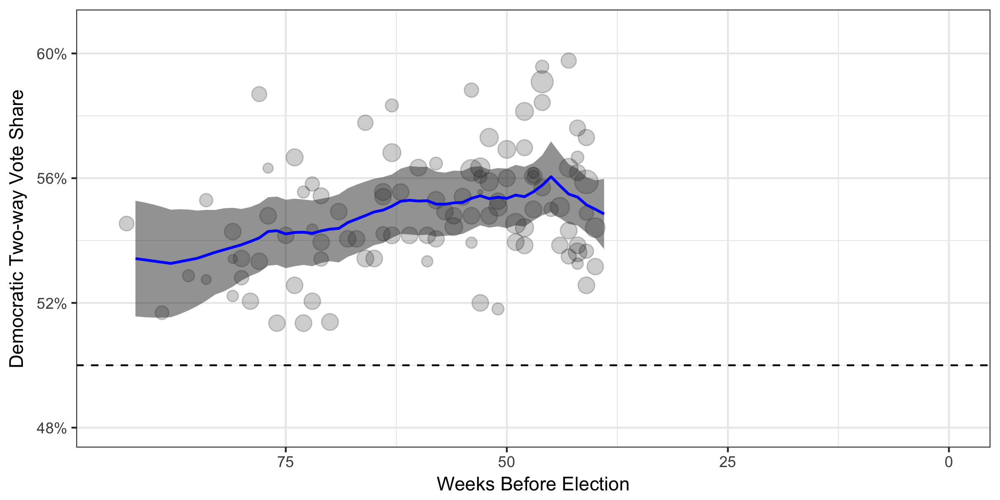
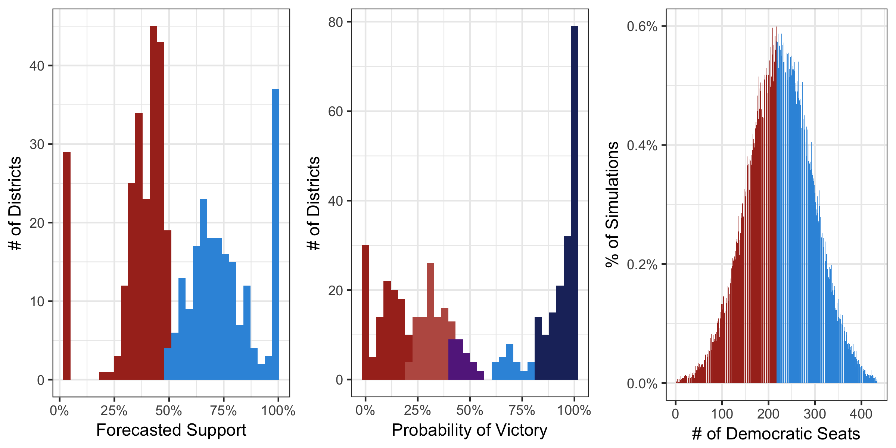
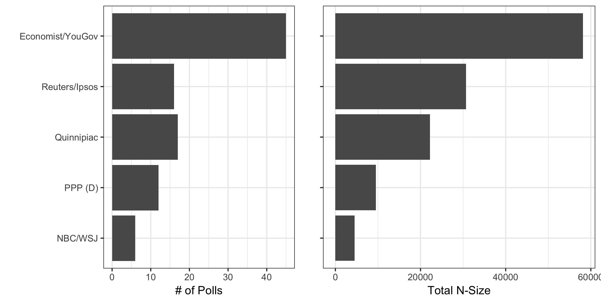

#Pooling the polls to forecast the 2018 US House elections
##Introduction
Using previously estimated pollster and sampling universe biases and current polling data, I forecast the results of the 2018 U.S. House of Representatives elections. My Bayesian model predicts Democrats will receive 54% of the popular vote, yielding 225 seats in the House of Representatives, 7 more than the 218 needed to win a majority. Based on current polling, Democrats win a majority of seats on Election Day in 55% of simulations. Lastly, I have identified about 30 battleground districts that would be strategic targets if swing from 2016 is roughly uniform.

##Week-by-week estimate of support
I use a Bayesian random-walk model to estimate the true level of support over time. Based on the most current data, my forecast gives Democrats 53.9% support on the two-way generic ballot, which translates to 225 seats in the House of Representatives. There is relatively little volatility in week-to-week movements. Whereas in the past six election cycles, 95% of week-to-week movement was within 1.5pp, this cycle, 95% of movement is within just 0.7pp. This perhaps reflects strong stability in voter opinion: regardless of the news cycle, most voters are consistent in their support. It is an important reminder that Democrats do not need to respond to the day-to-day and hour-to-hour machinations of Trump, but should focus on longer-term base building.

We saw the highest support for Democrats at the end of 2017, possibly associated with the Alabama special election or the tax bill, but there has been a slight slide in support since. Despite this, a +8 two-way margin is a good sign for Democrats. In comparison, at this point in 2010, Republicans polled at 54.2%, predicting they would win 227 seats; they won 242.

<center>
{ width=8in }
</center>

If the election were held today and assuming polling is not systematically flawed, there is a 100% chance that Democrats win over 50% of the popular vote, and more importantly, there is a 99% chance that they win a majority of seats in the House itself. However, we are still months away from the election. Simulations allow us to account for the variation we expect over time. Across 10,000 simulations of support __on election day__, Democrats win the popular vote in 62% of the simulations and a majority in the House in 55% of the simulations.

##Strategic targeting for 2018
Following [__Jackman (2014)__](https://www.cambridge.org/core/services/aop-cambridge-core/content/view/S1049096514000109), I apply national uniform swing to the 2016 two-way results of each Congressional district to identify key districts for targeting. About 30 districts have between a 40% and 60% chance of Democratic victory on election day, based on the national uniform swing. However, most of these key target seats are leaning towards Republicans; Democrats will need to win in over half of these to take back the House.

<center>
{ width=8in }
</center>

There are 198 seats where Democrats have more than a 60% chance of victory. 27 of these seats only lean towards the Democrat (less than an 80% chance of victory) and we must focus on protecting. An additional 91 seats lean Republican and are expansion seats if it looks like a wave year.

<center>
{ width=8in }
</center>

Importantly, since the election is still so far away, it's not clear which of these districts is the most likely to be the 218th seat. In general, Democrats should allocate resources to so-called 'tipping point' districts. As seen in the third column above, this implies a fairly broad investment strategy since the election is so distant. Right now, 364 districts have some nonzero likelihood of being the tipping point on Election Day, but if the election were held today, just 20 districts would deserve investment. Until these key districts become clearer, __Democrats should fight everywhere__.

An alternative to uniform swing that would give more precise rankings now is building a forecast using the named-congressional ballot. While polling in sufficiently large numbers to produce accurate estimates would be costly, it would generate:

  1. fine-grained, district-specific estimates of support that correctly rank the districts;
  
  2. district-specific uncertainty allowing us to identify which districts are more likely to swing than others. 

##Pollster and universe bias
Lastly, it is worth demonstrating that we observe only small changes in estimates of bias. Rasmussen was the reference pollster for this cycle, since its Bayesian prior had the least uncertainty (see Appendix A for more information) -- so its estimate has been fixed. Only two pollsters changed the sign of their bias: The Economist/YouGov went from overestimating Democratic support to being more conservative vis-a-vis Rasmussen, and Quinnipiac moved in the opposite direction. On one hand, there is not much evidence that other pollsters are consistently more or less biased than our previous estimate; on the other, in some cases we have enough evidence to detect that two pollsters updated their methodologies enough to detect directional change in their biases.

<center>
{ width=8in }
</center>

Similarly, the estimate for bias of registered voter universes is similar across time: just about 1.5pp towards Democrats. On the contrary, holding the bias of likely voter universes constant, adult universes are considerably less biased than in previous cycles, but are still quite biased. 

##The Data
The polling data were scraped from Real Clear Politics' database for the [__2018__](https://www.realclearpolitics.com/epolls/other/2018_generic_congressional_vote-6185.html#polls) generic Congressional ballot. Each pollster has a slightly different wording (hence why we measure pollster bias), but they are all similar to: 'If the elections for the U.S. House of Representatives were being held today, which party’s candidate would you vote for in your congressional district: The Democratic candidate or the Republican candidate?'  The named Congressional ballot question would account for incumbency effects and more closely mirror the choice voters will make in the voting booth. However, since not all candidates are known for 2018 yet, the generic ballot is the most common question being polled by public sources. 

Only polls where the year, date range, pollster, sampling universe and sample size are all known were included. 

Additionally, the polls' results were transformed to reflect the two-way share for Democrats (Dem/(Dem+Rep)): it is a proportion between 0 and 1. Almost all Congressional races are only seriously contested by these two parties and one candidate only needs a plurality of support to win. Therefore, to make probability-of-victory estimates, we can just build one model that predicts the share of the two-party vote, reducing computation time significantly. 

Time is transformed to be the rounded number of weeks between the middle day of the poll and election day. A daily model would be more precise, but would take more data to estimate with the same accuracy. Additionally, a weekly model acknowledges that most changes in support are transient and allows us to focus on meaningful changes. Lastly, the weekly model lowers the number of parameters that need to be estimated by a factor of 7, reducing computation time as well. 

Only sampling universes and pollsters who have polled in at least one of the last six election cycles are included. This is because I use estimates of bias observed over the last elections to account for polling house effects. See more [__here__](https://github.com/nickahamed/BSTM/blob/master/proj/pollster_bias.html).

As of February 12, 2018, 105 polls from 13 pollsters contacting 133k respondents were used. These are the 5 largest pollsters. See Appendix B for full details.

<center>
{ width=6in }
</center>

2016 U.S. House election results were taken from [__here__](https://github.com/Prooffreader/election_2016_data).

#Appendix A
To specify my random walk model, I follow [__Jackman (2005)__](http://eppsac.utdallas.edu/files/jackman/CAJP%2040-4%20Jackman.pdf). A given poll is assumed to be normally distributed with support as the mean and the standard deviation a function of $y_i$ and sample size. This would be specified as:
$$y_i \sim \mathcal{N}(\mu_i, \sigma^2_i)$$
That poll is centered around mean $\mu_i$, which itself is a function of $\alpha_t$, the true value of support at the time the poll was taken $t$, $\delta_j$, the bias of pollster $j$, and $\theta_k$, the bias of sampling universe $k$. Fully specified, this is: 
$$\mu_i = \alpha_{t_i} + \delta_{j_i} + \theta_{k_i}$$
Due to the trends we see in our initial data exploration, a random walk model is appropriate. In such a model, support at time $t$ is normally distributed around support at time $t - 1$. 
$$ \alpha_t \sim \mathcal{N}(\alpha_{t-1}, \omega^2) $$
For these given specifications, I start with the following priors: 
$$ \sigma^2_i = \frac{y_i(1-y_i)}{n_i},\ \ \ \alpha_1 \sim \mathcal{U}(0.46, 0.56),\ \ \ \omega \sim \mathcal{U}(0, (0.02/1.96))$$
$\sigma^2_i$ just follows the formula for variance of a sample. As a prior for the starting true value of support ($\alpha_1$), I use a uniform distribution over the minimum and maximum actual vote share of Democrats in the six elections analyzed. Lastly, as a prior for the true standard deviation ($\omega$), I use a uniform distribution between 0 and 0.01. A value of 0.01 would reflect that 95% of week-to-week movement is within about 2pp in either direction, a fairly weak assumption. These priors are similar to [__Strauss (2007)__](http://www.mindlessphilosopher.net/princeton/strauss_reverse%20random%20walk.pdf).

Unlike [__Jackman (2005)__](http://eppsac.utdallas.edu/files/jackman/CAJP%2040-4%20Jackman.pdf) and [__Strauss (2007)__](http://www.mindlessphilosopher.net/princeton/strauss_reverse%20random%20walk.pdf), I have strong priors for $\delta_j$ and $\theta_k$. Whereas they use a weak prior centered around 0, I use the best estimate from past election cycles and the observed uncertainty about that estimate. See more about the estimation of those [__here__](https://github.com/nickahamed/BSTM/blob/master/proj/pollster_bias.html), including the original priors and observed posteriors. However, using priors for all of the variables leaves the model underspecified. It is impossible to simultaneously estimate the bias for universe/pollster, and the true level of support each week. As such, I fix the prior for the pollster/universe for which we have the least uncertainty about at its bias estimate (set variance of prior = 0). Whereas past bias estimates were derived in relation to the true election result, this approach updates the priors in relation to this pollster/universe.

#Appendix B
##Load packages, functions and other setup 
```{r, message=FALSE, warning=FALSE}
library(ggplot2)
library(tidyverse)
library(rjags)
library(cowplot)
library(flextable)

source("forecasting_functions.R")

set.seed(102)
scipen=9
```

##Load, prep and explore data
```{r, message=FALSE, warning=FALSE}
pollster_lkup <- read.csv("data/pollster_lkup.csv")
deltas <- read.csv("data/final_pollster_bias_ests.csv")
thetas <- read.csv("data/final_universe_bias_ests.csv")
coefs <- read.csv("data/forecast_seats_coefs.csv")
past_final_est <- read.csv("data/final_est_comparison.csv")

house_2016 <- read.csv("data/house_general_election_2016.csv") %>%
  filter(individual_party %in% c("republican", "democrat")) %>%
  group_by(state, geo_name, individual_party) %>%
  mutate(vote_pct = ifelse(is.na(vote_pct), 100.0, vote_pct)) %>%
  summarise(vote_pct = sum(vote_pct)) %>%
  ungroup() %>%
  spread(key=individual_party, value = vote_pct, fill = 0) %>%
  mutate(twoway_vote = democrat/(democrat+republican))

polls <- read.csv("data/2018_polling.csv") %>%
  filter(pollster %in% pollster_lkup$pollster) %>%
  mutate(twoway = dem/(dem+rep)) %>% 
  mutate(week = round(as.numeric((as.Date(as.character("11/6/18"),  format="%m/%d/%y") - 
           as.Date(as.character(end_date),  format="%m/%d/%y")) + 
           (as.Date(as.character(end_date),  format="%m/%d/%y") - 
           as.Date(as.character(start_date),  format="%m/%d/%y"))/2)/7),
         n_size = as.numeric(as.character(n_size)))

polling_summary <- polls %>% 
  group_by(pollster) %>%
  summarise(`Total N-Size` = sum(n_size), 
            `# of Polls` = n()) %>%
  arrange(desc(`Total N-Size`)) %>%
  inner_join(pollster_lkup, by = "pollster") %>%
    mutate(pollster_raw = factor(pollster_raw, levels = pollster_raw[order(`Total N-Size`)]))

polling_summary_ft <- polling_summary %>% 
  mutate(nsize = as.character(`Total N-Size`),
         polls = `# of Polls`) %>%
  select(pollster_raw, nsize, polls)

FT1 <- flextable(polling_summary_ft)
FT1 <- set_header_labels(FT1, pollster_raw = "Pollster", nsize = "Total N-Size", polls = "# of Polls")

FT1 <- theme_zebra(x = FT1, odd_header = "#CFCFCF", odd_body = "#EFEFEF",
even_header = "transparent", even_body = "transparent")
FT1 <- align(x = FT1, j = 1, align = "left", part = "all")
FT1 <- align(x = FT1, j = 2:3, align = "center", part = "all")
FT1 <- bold(x = FT1, bold = TRUE, part = "header")
FT1
```

```{r, include=FALSE}
#Plots for above
x1 <- ggplot(data = (polling_summary[1:5,]), aes(y = `# of Polls`, x = pollster_raw)) +
  geom_bar(stat = 'identity') +
  coord_flip() + 
  theme_bw() + 
  xlab("") 

x2 <- ggplot(data = (polling_summary[1:5,]), aes(y = `Total N-Size`, x = pollster_raw)) +
  geom_bar(stat = 'identity') +
  coord_flip() + 
  theme_bw() + 
  xlab("") + 
  theme(axis.text.y = element_blank())

ggsave(filename = "figures/2018_data_breakdown.png", plot = plot_grid(x1, x2, nrow = 1), width = 8, height = 4, units = "in")
```

##Estimate week-by-week movement using past pollster and universe biases
```{r, warning=FALSE, message=FALSE, results=FALSE}
data_jags <- data_prep(data = polls, res = res, year = 2018, anchor = F)
data_jags <- bias_priors(data_jags = data_jags, deltas = deltas, thetas = thetas, anchor = F)

convergence_2018 <- convergence_diagnostics(data_jags = data_jags,
                                            anchor = F,
                                            chains = 4, 
                                            thining = 10, 
                                            burnin = 10000, 
                                            iter = 1000000)

mod_res <- run_model(data_jags = data_jags, 
                     params = c("xi", "omega", "delta", "theta"), 
                     anchor = F,
                     chains = 4, 
                     thining = 10, 
                     burnin = 10000, 
                     iter = 1000000)
cycle_time_est <- extract_time_est(mod_res = mod_res, year = 2018, data_jags = data_jags) %>%
  mutate(time_before_elec = time_before_elec + (max(data_jags$week) - max(data_jags$week_adj)))
omega <- extract_omega_est(mod_res = mod_res, year = 2018, data_jags = data_jags)
```

```{r, include=FALSE}
time_series_with_trend <- ggplot(data=cycle_time_est, aes(x=time_before_elec, y=iter_mean)) + 
  geom_point(data=polls, aes(x=week, y=twoway, size=sqrt(n_size)), alpha=0.2) +
  geom_ribbon(aes(ymin=lower_bound,ymax=upper_bound), alpha = 0.5) +
  geom_line(color = "blue",size = 0.75) +
  theme_bw() + 
  scale_x_reverse(name = "Weeks Before Election", limits= c(94, 0)) +
  scale_y_continuous(name = "Democratic Two-way Vote Share", labels=scales::percent, limits = c(min(0.48, min(polls$twoway) - 0.01), max(0.6, max(polls$twoway) + 0.01))) + 
  guides(size=F, color = F) + 
  geom_hline( aes(yintercept = 0.5), linetype="dashed") 

ggsave(filename = "figures/2018_time_series_with_trend.png", plot = time_series_with_trend, width = 8, height = 4, units = "in")
```

##Predict # of seats won and probability of taking back the House
```{r, warning=FALSE}
message(paste0("Convergance diagnostics for sample 2018 parameters:"))
print(convergence_2018$gelman)
print(convergence_2018$autocorr)

message(paste0("95% CI for week-to-week movement:"))
scales::percent(round(as.numeric(omega)*1.96,4))

##If the election were held today
mod_csim <- as.mcmc(do.call(rbind, mod_res))
mod_csim <- as.data.frame(mod_csim)
final_param <- paste0("xi[",(length(names(mod_csim))-(1+length(unique(data_jags$pollster))+length(unique(data_jags$univ)))),"]")
final_forecast_posterior <- mod_csim[,final_param]

message(paste0("Current forecast of support:"))
scales::percent(round(mean(final_forecast_posterior),3))

message(paste0("Probability of 50% popular vote today:"))
scales::percent(round(mean(final_forecast_posterior > 0.5),3))

predict_seats <- round((coefs[1,1] + coefs[2,1]*mean(final_forecast_posterior))*435)
message(paste0("Number of seats estimated today:"))
predict_seats

final_seats_posterior <- round((coefs[1,1] + coefs[2,1]*final_forecast_posterior)*435)
message(paste0("Probability of a majority of seats today:"))
scales::percent(round(mean(final_seats_posterior > 217),3))


##Adding in error over time
new_means <- rnorm(100000, mean = mean(final_forecast_posterior), sd = (as.numeric(omega)*min(cycle_time_est$time_before_elec)))
new_seats <- round((coefs[1,1] + coefs[2,1]*new_means)*435)

message(paste0("Probability of 50% popular vote on election day:"))
scales::percent(round(mean(new_means > 0.5),3))

message(paste0("Probability of a majority of seats on election day:"))
scales::percent(round(mean(new_seats > 217),3))
```

##Strategic analysis
```{r, warning=FALSE, message=FALSE, results=FALSE}
nat_swing <- mean(final_forecast_posterior) - 
  as.numeric(substr(past_final_est$Popular.Vote[past_final_est$Cycle == 2016],1,4))/100

house_2016$dist_forecast <- house_2016$twoway_vote + nat_swing
house_2016$dist_lb <- house_2016$twoway_vote - 1.96*(as.numeric(omega)*min(cycle_time_est$time_before_elec))
house_2016$dist_ub <- house_2016$twoway_vote + 1.96*(as.numeric(omega)*min(cycle_time_est$time_before_elec))

house_2016$prob_victory <- 0
house_2016$cd <- ""

for (i in 1:nrow(house_2016)) {
  dist_mean <- rnorm(100000, mean = house_2016$dist_forecast[i], sd = (as.numeric(omega)*min(cycle_time_est$time_before_elec)))
  house_2016$prob_victory[i] <- mean(dist_mean > 0.5)
  house_2016$cd[i] <- paste(state.abb[grep(house_2016$state[i], state.name)], strsplit(as.character(house_2016$geo_name[i])," ")[[1]], sep = " - ")
}

house_2016$strat_import <- ifelse(house_2016$prob_victory < 0.6 & house_2016$prob_victory > 0.4, 1, 0)

n_size <- 10000
temp_dists <- data.frame(support = numeric(435), seat = numeric(435))
tipping_point <- data.frame(state = character(n_size), dist = character(n_size), stringsAsFactors=FALSE)

for (i in 1:n_size) {
  for (j in 1:nrow(house_2016)) {
    temp_dists$state[j] <- paste(house_2016$state[j])
    temp_dists$dist[j] <- paste(house_2016$geo_name[j])
    temp_dists$support[j] <- rnorm(1, mean = house_2016$dist_forecast[j], sd = (as.numeric(omega)*min(cycle_time_est$time_before_elec)))
  }
  
  temp_dists <- temp_dists %>%
    arrange(-support)
  
  tipping_point$state[i] <- temp_dists$state[218]
  tipping_point$dist[i] <- temp_dists$dist[218]
}

tp_dists <- tipping_point %>%
  group_by(state, dist) %>%
  summarise(tp_pct = n()/n_size)

house_2016 <- house_2016 %>%
  left_join(tp_dists, by  = c("geo_name" = "dist", "state" = "state")) %>% 
  mutate_each(funs(replace(., which(is.na(.)), 0))) %>%
  mutate(win = ifelse(dist_forecast > 0.5, 1, 0),
         class = ifelse(prob_victory > 0.8, 1, 
                        ifelse(prob_victory > 0.6, 0.75,
                               ifelse(prob_victory > 0.4, 0.5,
                                      ifelse(prob_victory > 0.2, 0.25, 0)))),
         dist_forecast = ifelse(dist_forecast > 1, 1, dist_forecast))
```

```{r, include = F}
stat_districts <- house_2016 %>%
  filter(strat_import == 1) %>%
  mutate(cd = factor(cd, levels = cd[order(prob_victory)]))

seats_df <- data.frame(new_seats = new_seats, new_seats_wins = ifelse(new_seats > 217, 1, 0)) %>%
  filter(new_seats < 435, new_seats > 0)

hist1 <- ggplot(house_2016, aes(x = dist_forecast, fill =  factor(win))) + 
  geom_histogram() +
  theme_bw()+
  guides(fill= F) + 
  scale_x_continuous(labels = scales::percent, name = "Forecasted Support") + 
  ylab("# of Districts")  + 
  scale_fill_manual(values = c("#A83022", "#3596DD"))

hist2 <- ggplot(house_2016, aes(x = prob_victory, fill =  factor(class))) + 
  geom_histogram() +
  theme_bw()+
  guides(fill= F) + 
  scale_x_continuous(labels = scales::percent, name = "Probability of Victory") + 
  ylab("# of Districts")  + 
  scale_fill_manual(values = c("#A83022", "#BC5B51", "#64288C", "#3596DD", "#1F2F6A"))

hist3 <- ggplot(seats_df, aes(x = new_seats, fill =  factor(new_seats_wins))) + 
  geom_bar(aes(y = (..count..)/sum(..count..))) + 
  theme_bw()+
  guides(fill= F) + 
  scale_y_continuous(labels = scales::percent, name = "% of Simulations") + 
  xlab("# of Democratic Seats")  + 
  scale_fill_manual(values = c("#A83022", "#3596DD"))

ggsave(filename = "figures/2018_histograms.png", plot = plot_grid(hist1, hist2, hist3, nrow = 1), width = 8, height = 4, units = "in")

y1 <- ggplot(stat_districts, aes(x = dist_forecast, y = cd, color = dist_forecast)) + 
  geom_point() + 
  theme_bw() + 
  geom_vline(xintercept = 0.5, linetype = "dashed") +
  scale_colour_gradient2(low = "red", mid = "grey",
  high = "blue", midpoint = 0.5) +
  guides(color = F) +
  ylab("") +
  scale_x_continuous(limits =  c(min(stat_districts$dist_forecast)-0.01,max(stat_districts$dist_forecast)+0.01), labels = scales::percent, name = "District Forecast")

y2 <- ggplot(stat_districts, aes(x = prob_victory, y = cd, color = prob_victory)) + 
  geom_point() + 
  theme_bw() + 
  geom_vline(xintercept = 0.5, linetype = "dashed") +
  scale_colour_gradient2(low = "red", mid = "grey",
  high = "blue", midpoint = 0.5) +
  guides(color = F) +
  ylab("") +
  scale_x_continuous(limits =  c(min(stat_districts$prob_victory)-0.01,max(stat_districts$prob_victory)+0.01), labels = scales::percent, name = "Probability of Victory") + 
  theme(axis.text.y = element_blank())

y3 <- ggplot(stat_districts, aes(x = cd, y = tp_pct)) + 
  geom_bar(stat = "identity", fill = "grey38") + 
  coord_flip() + 
  theme_bw() + 
  guides(fill = F) +
  xlab("") +
  scale_y_continuous(limits =  c(0,max(stat_districts$tp_pct)+0.005), labels = scales::percent, name = "Probability of Tipping point") + 
  theme(axis.text.y = element_blank())

ggsave(filename = "figures/2018_strategy.png", plot = plot_grid(y1, y2, y3, nrow = 1), width = 8, height = 6, units = "in")
```

```{r, include = F}
predictions_record <- read.csv("data/predictions_record.csv")
weekly_update <- data.frame(date = as.character(Sys.Date()), 
                            weeks_till = min(cycle_time_est$time_before_elec),
                            estimate = mean(final_forecast_posterior),
                            prob_victory_today = mean(final_forecast_posterior > 0.5),
                            prob_victory_eday = mean(new_means > 0.5),
                            seats = predict_seats,
                            prob_majority_today = mean(final_seats_posterior > 217),
                            prob_majority_eday = mean(new_seats > 217),
                            omega_mvmt_95 = as.numeric(omega)*1.96,
                            stringsAsFactors = F)
weekly_update <- rbind(predictions_record,weekly_update)
write.csv(weekly_update, "data/predictions_record.csv", row.names = F)

prior_ests <- calculate_priors(mod_res = mod_res, year = 2018, data_jags = data_jags)
new_deltas <- prior_ests$deltas_est %>%
    filter(!is.na(delta_mu)) %>% 
    arrange(delta_mu) %>%
    inner_join(pollster_lkup, by = c("delta_pollster" = "pollster")) %>%
    mutate(pollster_raw = factor(pollster_raw, levels = pollster_raw[order(delta_mu)]),
           est = "Posterior")
old_deltas <- deltas %>% 
  filter(delta_pollster %in% new_deltas$delta_pollster) %>% 
  mutate(est = "Prior")

new_deltas <- rbind(new_deltas, old_deltas)

pollster_bias <- ggplot(new_deltas, aes(x=pollster_raw, y=delta_mu, color = est, group = pollster_raw)) + 
  geom_line(size = 3, color = "gray38", alpha = 0.5) + 
  geom_point(size = 3) +
  geom_point(shape = 1,colour = "black", size = 3)+
  geom_hline(yintercept = 0, linetype = "dashed") + 
  scale_colour_manual(values = c("gray90", "black")) +
  theme_bw() +
  theme(legend.position="bottom", legend.title = element_blank()) +
  xlab("Pollster") +
  scale_y_continuous(name = "Bias Estimate", labels = scales::percent, limits = c(-0.02,0.01)) + 
  theme(axis.text.x = element_text(angle = 90, hjust = 1, size = 10, vjust = 0.5))

ggsave(filename = "figures/2018_pollster_bias.png", plot = pollster_bias, width = 8, height = 4, units = "in")

new_thetas <- prior_ests$thetas_est %>% 
    arrange(theta_mu) %>%
    mutate(est = "Posterior",
        theta_univ2 = ifelse(theta_univ == "LV", "Likely Voters", ifelse(theta_univ == "RV", "  Registered Voters", "Adults")),
        theta_univ = factor(theta_univ, levels = theta_univ[order(theta_mu)]),
        theta_univ2 = factor(theta_univ2, levels = theta_univ2[order(theta_mu)]))

old_thetas <- thetas %>% 
  mutate(est = "Prior",
         theta_univ2 = ifelse(theta_univ == "LV", "Likely Voters", ifelse(theta_univ == "RV", "  Registered Voters", "Adults")))
  
new_thetas <- rbind(new_thetas, old_thetas) 

univ_bias <- ggplot(new_thetas, aes(x=theta_univ, y=theta_mu, color = est, group = theta_univ)) + 
  geom_line(size = 3, color = "gray38", alpha = 0.5) + 
  geom_point(size = 3) +
  geom_point(shape = 1,colour = "black", size = 3)+
  geom_hline(yintercept = 0, linetype = "dashed") + 
  scale_colour_manual(values = c("gray90", "black")) +
  theme_bw() +
  theme(legend.position="bottom", legend.title = element_blank()) +
  xlab("Universe") +
  scale_y_continuous(name = "Bias Estimate", labels = scales::percent, limits =  c(-0.01,0.045)) + 
  theme(axis.text.x = element_text(angle = 90, hjust = 1, size = 10, vjust = 0.5))

ggsave(filename = "figures/2018_universe_bias.png", plot = univ_bias, width = 4, height = 4, units = "in")

pollster_bias2 <- ggplot(new_deltas, aes(x=pollster_raw, y=delta_mu, color = est, group = pollster_raw)) + 
  geom_line(size = 3, color = "gray38", alpha = 0.5) + 
  geom_point(size = 3) +
  geom_point(shape = 1,colour = "black", size = 3)+
  geom_hline(yintercept = 0, linetype = "dashed") + 
  scale_colour_manual(values = c("gray90", "black")) +
  theme_bw() +
  theme(legend.position="bottom", legend.title = element_blank()) +
  xlab("Pollster") +
  scale_y_continuous(name = "Bias Estimate", labels = scales::percent, limits = c(-0.02,0.045)) + 
  theme(axis.text.x = element_text(angle = 90, hjust = 1, size = 10, vjust = 0.5))

univ_bias2 <- ggplot(new_thetas, aes(x=theta_univ2, y=theta_mu, color = est, group = theta_univ)) + 
  geom_line(size = 3, color = "gray38", alpha = 0.5) + 
  geom_point(size = 3) +
  geom_point(shape = 1,colour = "black", size = 3)+
  geom_hline(yintercept = 0, linetype = "dashed") + 
  scale_colour_manual(values = c("gray90", "black")) +
  theme_bw() +
  theme(legend.position="bottom", legend.title = element_blank()) +
  xlab("Universe") +
  scale_y_continuous(name = "Bias Estimate", labels = scales::percent, limits =  c(-0.02,0.045)) + 
  theme(axis.text.x = element_text(angle = 90, size = 10, vjust = 0.5, hjust=1)) + 
  theme(axis.text.y = element_blank(),
        axis.title.y = element_blank())

ggsave(filename = "figures/2018_bias_update.png", plot = plot_grid(pollster_bias2, univ_bias2, nrow = 1,  rel_widths = c(2, 1)), width = 8, height = 4, units = "in")
```

