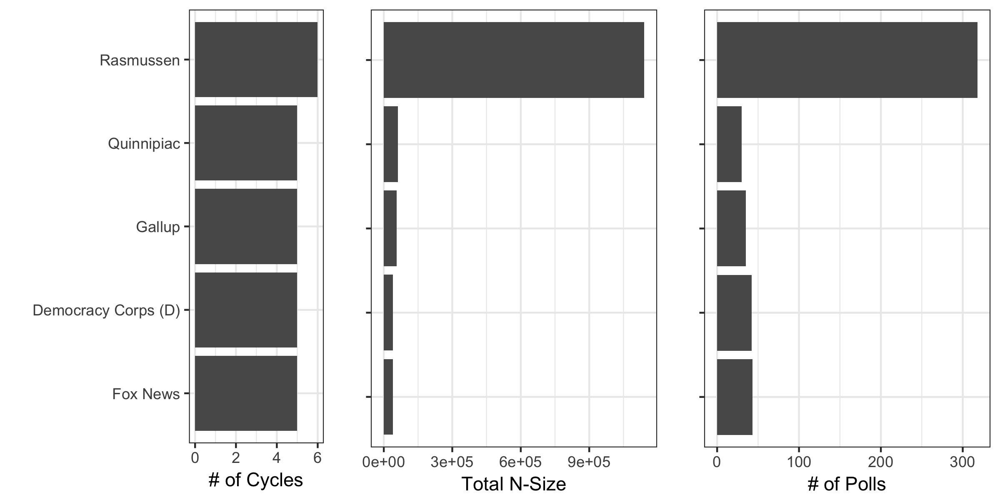
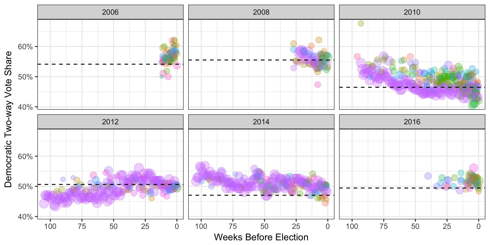
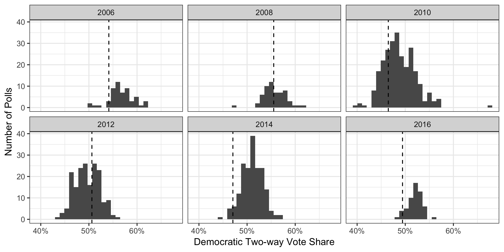
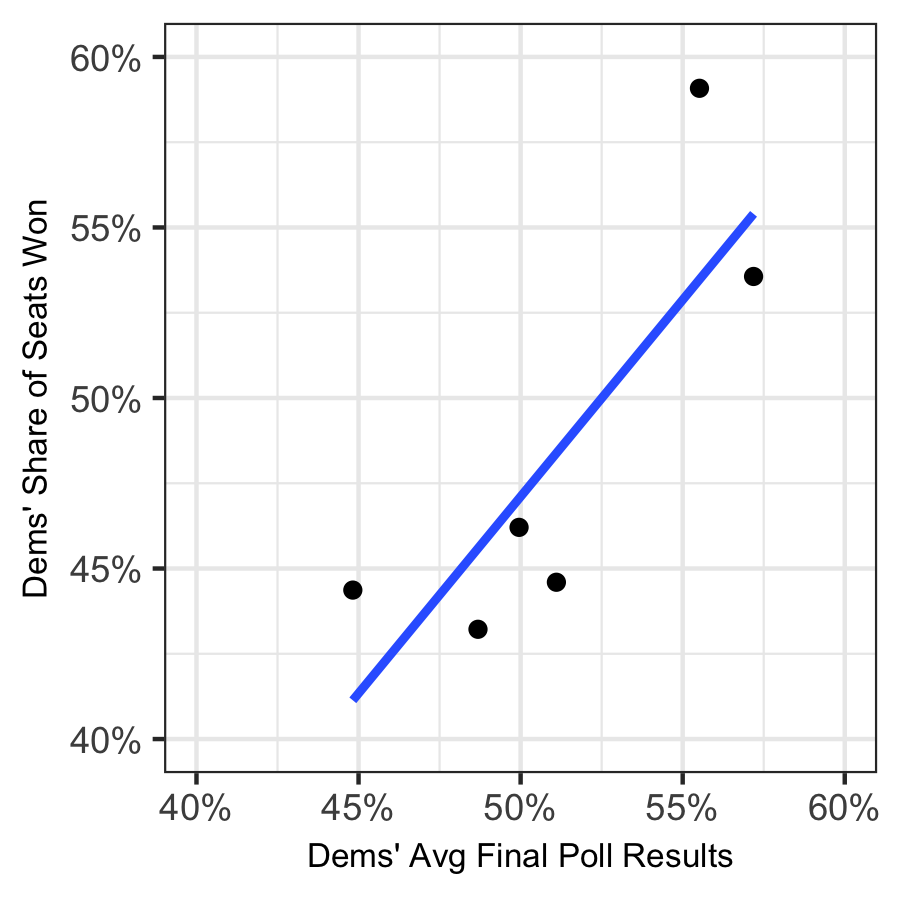
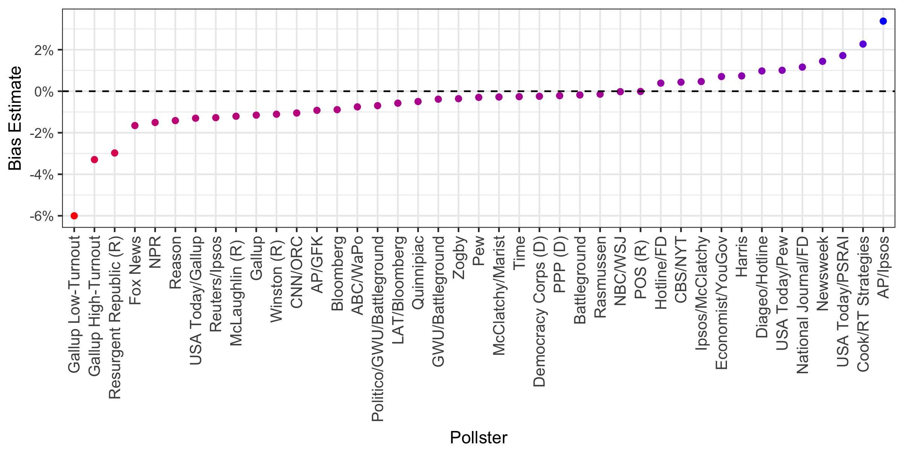
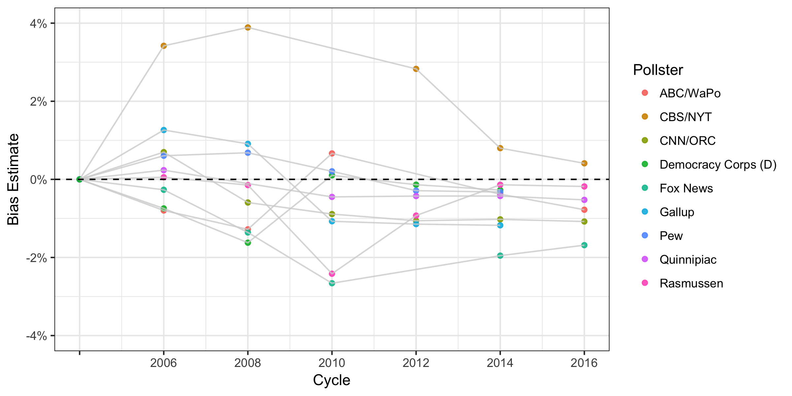
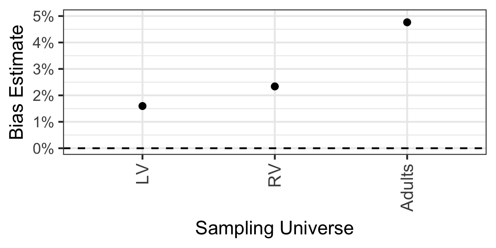
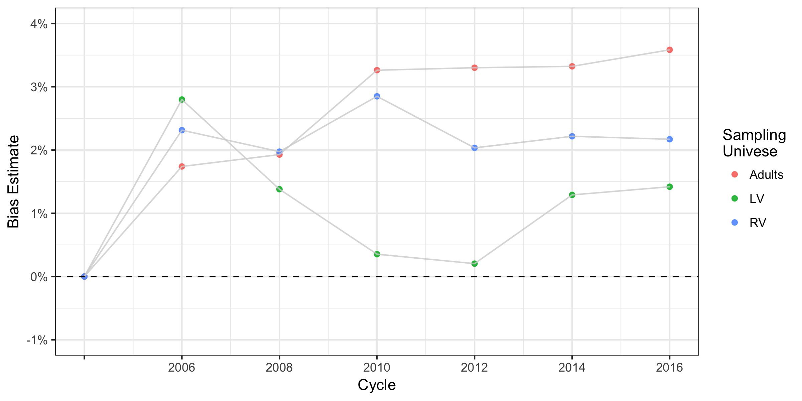
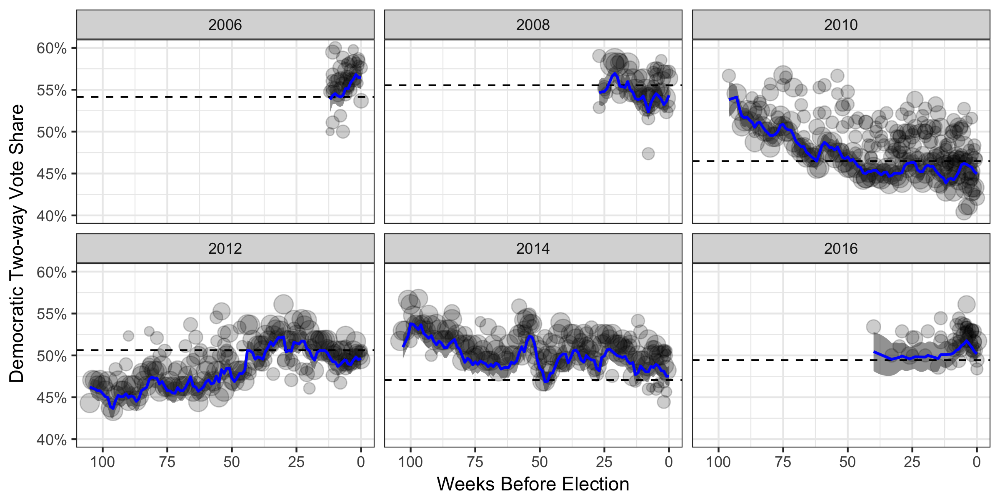
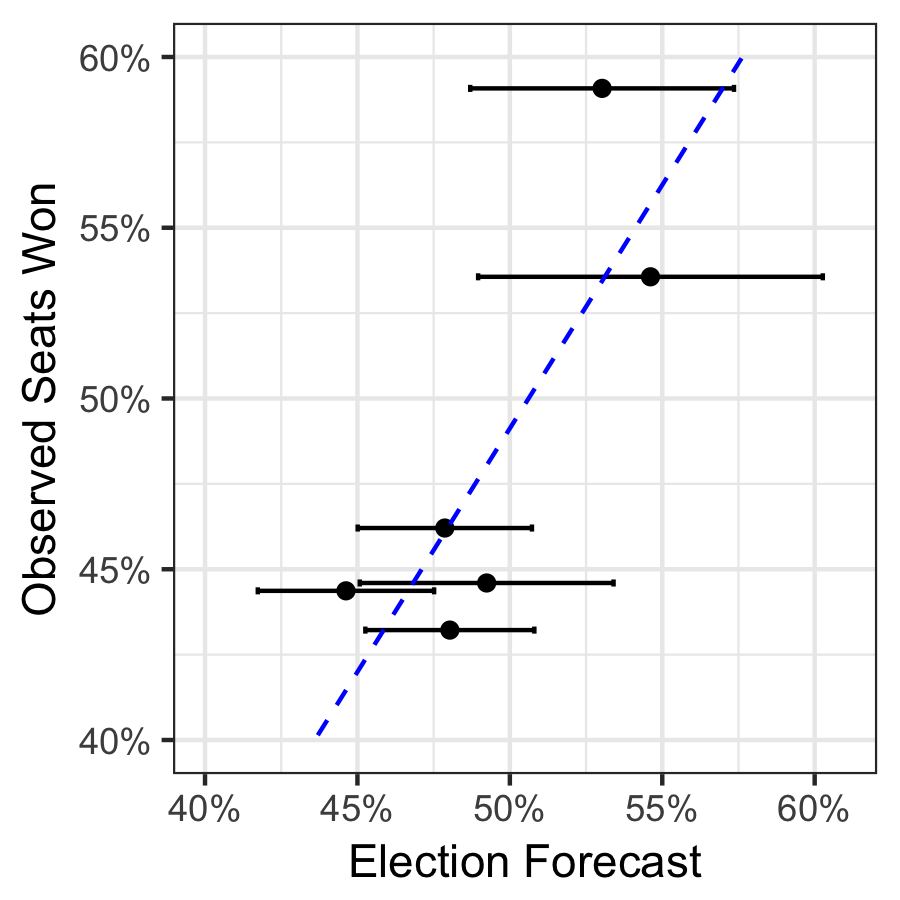

```{r setup, include=FALSE}
library(flextable)
```
#Pooling the polls to estimate bias in past US House Elections
##Introduction
In this analysis, I estimate the bias for each public pollster active in the last 6 congressional elections. My final estimate identifies Gallup(Low-Turnout) as the most conservative pollster and AP/Ipsos as the most liberal. I likewise estimate bias of various sampling universes. Next, I use these biases to estimate the true level of support for Democrats over time in each cycle. Lastly, I regress the final estimate of support in each cycle against the number of seats Democrats won.  

##The Data
I have two primary sources of data: past polls and election results. The poll response that I use is the 'generic Congressional ballot.' Each pollster has a slightly different wording (and hence why we measure pollster bias), but they are all similar to: 'If the elections for the U.S. House of Representatives were being held today, which party’s candidate would you vote for in your congressional district: The Democratic candidate or the Republcian candidate?'  The named Congressional ballot question would account for incumbency effects and more closely mirror the choice voters are making in the voting booth. However, since not all candidates are known for 2018 yet, this is the only current question being polled, and so for comparability, I will use the same question for past elections.

The past polls were taken from Real Clear Politics' database across 6 election cycles: [__2006__](https://realclearpolitics.com/epolls/other/2006_generic_congressional_vote-2174.html), [__2008__](https://www.realclearpolitics.com/epolls/other/2008_generic_congressional_vote-2173.html#polls), [__2010__](https://www.realclearpolitics.com/epolls/other/2010_generic_congressional_vote-2171.html#polls), [__2012__](https://www.realclearpolitics.com/epolls/other/2012_generic_congressional_vote-3525.html#polls), [__2014__](https://www.realclearpolitics.com/epolls/other/generic_congressional_vote-2170.html) and [__2016__](https://www.realclearpolitics.com/epolls/other/2016_generic_congressional_vote-5279.html#polls). Only polls where the year, date range, pollster, sampling universe and sample size are all known were included. Additionally, the polls' results were transformed to reflect the two-way share for Democrats (Dem/(Dem+Rep)): it is a proportion between 0 and 1. Time is transformed to be the rounded number of weeks between the middle day of the poll and election day. A daily model would be more precise, but would take more data.

In total, 797 polls from 41 pollsters contacting 1.7m respondents over the 6 election cycles were used. These are the 5 largest pollsters. See Appendix B for full details.

<center>
{ width=6in }
</center>

For election results, I use both the popular vote share and the seats won. These were taken from Wikipedia: [__2006__](https://en.wikipedia.org/wiki/United_States_House_of_Representatives_elections,_2006), [__2008__](https://en.wikipedia.org/wiki/United_States_House_of_Representatives_elections,_2008), [__2010__](https://en.wikipedia.org/wiki/United_States_House_of_Representatives_elections,_2010), [__2012__](https://en.wikipedia.org/wiki/United_States_House_of_Representatives_elections,_2012), [__2014__](https://en.wikipedia.org/wiki/United_States_House_of_Representatives_elections,_2014), and [__2016__](https://en.wikipedia.org/wiki/United_States_House_of_Representatives_elections,_2016). Again, I use Democrats' two-way vote share of the popular vote to mimic their two-way support in the polling data, and their percentage share of seats in the Congress. 

First, let's explore the trends over time in each cycle. Here, each point is a poll; it's size relfects the sample size and color represents the pollster. The dashed line represents the final two-way popular vote share of Democrats. A couple of observations from this are clear. We see that by election, some pollsters are systematically off. For example, the pink pollster in 2010 was consistently below the final election result, suggesting bias. Last, we see that there are trends in results over time. For example, in 2014 the polls got closer and closer to the true result over time. Further investigation shows that poll results are not normally distributed around the result **across time**, suggesting we will need a time-dependent model. 

<center>

</center>

```{r, out.width="8in", out.height="3in", echo=FALSE, message=F, warning=F,  fig.align='center',include=FALSE}

```

```{r, out.width="3in", out.height="3in",echo=FALSE, message=F, warning=F,  fig.align='center',include=FALSE}

```

##Estimating pollster and universe bias
To estimate bias for each pollster and universe, I use a Bayesian random-walk models anchored to the true final election results. For the first cycle a pollster/universe is used in, its prior is normally distributed around 0pp and assumed to be less than 20pp 95% of the time, in either direction. This prior is updated to be the posterior from the most recent previous cycle the pollster/universe was active in. Full specification of the theoretical model can be found in Appendix A; implementation specifications and key convergance diagnostics can be found in Appendix B. 

Below I plot the final bias estimate for each pollster. For example, for a pollster who polled in 2014 but not 2016, this will be their 2014 posterior results. Most pollsters are not biased by more than a percentage point in either direction. 'Gallup Low-Turnout' was the mostly conservative estimate (they took 4 polls in 1 election cycle). 'AP/Ipsos' most consistently overestimted Democratic support (they took 4 polls in 2 election cycles). POS (R) was the least biased pollseter with an average bias of -0.00025 across their 3 polls in 1 cycles. Full results can be found in Appendix B.

<center>

</center>

Looking more closely at pollsters that were active in at least 5 of the 6 cycles examine, we some variation in bias across cycles. For example, CBS/NYT strongly oveestimated Democratic support in 2008, but became less and less biased each cycle. Others were too conservative in some cycles and too liberal in others. Fox News underestimated Democratic support in all.

<center>

</center>

Additionally, we see that most sampling universes also show some overestimation of Democratic support. Our posterior observation from the 2016 cycle shows that likely voter universes across pollsters were biased 0.9pp in favor of Democrats, registered voter universes were biased 1.3pp and samples of just adults were biased nearly 4pp in favor of Democrats. Full results can be found in Appendix B.

<div style= "float:left;position: relative; top: -10px;">
{ width=4in }
</div>

These trends were fairly stable over time. The rank order of the universes was the same for all elections except 2006. Both adult and registered voter universes were stable around their final estimate since the 2010 cycle. In 2010, there was basically no bias in likely voter universes, but this increased in the following three elections. 

<center>

</center>

##Week-by-week estimates of support by cycle
Using the final estimates of bias for pollsters and universes as priors, I now refit the random-walk models, but with no anchor to the true result. This allows us to generate estimates week-by-week for each election, including a final estimate of election outcome, simulating a future prediction. The results are slightly overfit, especially for 2016, since the true results in each election updated the priors which are now inputs to the model. For 2016 specifically, the priors are derived from posterior distribution of the model anchored in the true result, so we should expect the model to be very precise. For full model specification see Appendix A and Appendix B for implementaton, code and full results. 

The figure below highlights a few key trends. First, the estimated 'true' trendline for each election cycle is shifted slightly below the polls. This is due to the fact that our estimates of universe bias (above) were consistently overestimating Democratic support. Additional bias from polling house effects are split between over- and under-estimating Democratic support. 

Second, while there appears to be significant variation over time in the polls, the trendlines are much smoother. In fact, week-over-week, the models estimate 95% of movement is less than 1.5pp. The model used here has one parameter for week-to-week movement, so it averages over big swings (see weeks 63-50 in 2014) and small, incremental changes (see weeks 100-63 in 2014). A model that separates out these trends might better identify which swings are real, substantive movements, and which should be smoothed.

<center>

</center>

<div style= "float:right;position: relative; top: -10px; right: 10px">
```{r, echo=F, warning=F, message=F}
tbl_display <- read.csv("data/final_est_comparison.csv")
FT1 <- flextable(tbl_display)
FT1 <- theme_zebra(x = FT1, odd_header = "#CFCFCF", odd_body = "#EFEFEF",
even_header = "transparent", even_body = "transparent")
FT1 <- align(x = FT1, j = 1, align = "left", part = "all")
FT1 <- align(x = FT1, j = 2:5, align = "center", part = "all")
FT1 <- bold(x = FT1, bold = TRUE, part = "header")
FT1
```
</div>

<br>
<br>
Third, some cycles' models are more accurate than others. This table shows the percentage point error of each final forecast. In 2014 and 2016, our models were very accurate. In 2008, and 2012, they missed by about a point, and in 2010 and 2012. The error is not consistently biased in one direction, but instead sometimes overestimates and sometimes underestimates Democratic support.

<div style= "float:left;position: relative; top: 10px;">
{ width=2in }
</div>

The model that adapts for both past pollster and sampling universe bias is more accurate than a model that accounts for just pollster bias or no bias at all. Over the six cycles analyzed here, there is a reduction in error just over 0.3pp compared to the model with no bias and just under 0.3pp over the model that just accounts for pollster bias.

Lastly, we are interested in the relationship between the final forecasts and the actual share of seats won. Becuase of our winner-take-all and gerrymandered system, the popular vote rarely translates directly into share of seats won. A simple linear regression shows that 69% of the variation in seats won over the last 6 elections is explained by the forecasts produced here. Additionally, Democrats need to be forecasted to win about 52% of the popular vote to win 50% of the seats.

##Conclusions
Using past public polling data and election results, I generated bias estimates for each pollster and sampling universe activly polling the generic Congressional ballot over the past six cycles. Generally, pollsters are consistently biased by less than 1pp, but a several still exceed this theshold. Of the pollsters analyzed, I find POS (R) and NBC/WSJ are the least biased pollsters. Likewise, I find that likely voter sampling universes are less biased than registered voter or adult universes. All three universes tend to overestimate the true level of Democratic support. 

I then use these (admittedly overfit) estimates of bias to generate forecasts for the six cycles analyzed. The final forecasts had a mean absolute error of about 1.3pp, though five-of-six correctly predicted the winner. These forecasts are fairly predictive of the final seat share Democrats would win.

#Appendix A
For a formal model, I follow [__Jackman (2005)__](http://eppsac.utdallas.edu/files/jackman/CAJP%2040-4%20Jackman.pdf) to specify my model to estimate biases, but with an added term for sampling universe. A given poll is assumed to be normally distruted with support as the mean and the variance a function of $y_i$ and sample size. This would be specified as:
$$y_i \sim \mathcal{N}(\mu_i, \sigma^2_i)$$
That poll is centered around mean $\mu_i$, which itself is a function of $\alpha_t$, the true value of support at the time the poll was taken $t$, $\delta_j$, the bias of pollster $j$, and $\theta_k$, the bias of sampling universe $k$. Fully specified, this is: 
$$\mu_i = \alpha_{t_i} + \delta_{j_i} + \theta_{k_i}$$
Due to the trends we see in our initial data exploration, a random walk model is appropriate. In such a model, support at time $t$ is normally distributed around support at time $t - 1$. 
$$ \alpha_t \sim \mathcal{N}(\alpha_{t-1}, \omega^2) $$
By anchoring the model in the final election results, and by using a random walk, I will be able to estimate the consistent bias, $\delta$, of each pollster and the effect, $\theta$, of different sampling universes. 

For these given specifications, we start with the following priors: 
$$ \sigma^2_i = \frac{y_i(1-y_i)}{n_i},\ \ \ \alpha_1 \sim \mathcal{U}(0.46, 0.56),\ \ \ \omega \sim \mathcal{U}(0, (0.02/1.96))$$
$\sigma^2_i$ just follows the formula for variance of a sample. As a prior for the starting true value of support ($\alpha_1$), I use a uniform distribution over the minimum and maximum actual vote share of Democrats in the six elections analyzed. Lastly, as a prior for the true variance of support ($\omega$), I use a uniform distribution between 0 and 0.01. A value of 0.01 would reflect that 95% of week-to-week movement is within about 2pp in either direction, a fairly weak assumption. These priors are similar to [__Strauss (2007)__](http://www.mindlessphilosopher.net/princeton/strauss_reverse%20random%20walk.pdf) 

$$\ \ \ \delta_j \sim \mathcal{N}(0, (0.2/1.96)^2),\ \ \ \theta_k \sim \mathcal{N}(0, (0.2/1.96)^2)$$

For pollster biases ($\delta$), I start with a prior that there is no bias with a standard deviation to reflect that bias is 95% of the time within 20pp in either direction; likewise, I start with a prior for bias from sampling universe ($\theta$) that is the same. However, these priors are updated based upon the previous election cycle. Thus, this prior is true for the fist cycle the pollster was active in (often 2006). Subsequently, the prior is the mean of the posterior observatons of ($\delta_{j_{most\ recent\ cycle}}$) and variance of the same posterior observations. 

#Appendix B
##Load packages, functions and other setup 
```{r, message=FALSE, warning=FALSE}
library(ggplot2)
library(tidyverse)
library(rjags)
library(cowplot)
library(flextable)

source("forecasting_functions.R")

set.seed(102)
scipen=999
```

##Load, prep and explore data
```{r, message=FALSE, warning=FALSE}
pollster_lkup <- read.csv("data/pollster_lkup.csv")

res <- read.csv("data/election_results.csv") %>%
  mutate(twoway_vote = dem_vote/(dem_vote+rep_vote),
         twoway_seat = dem_seats/(dem_seats+rep_seats)) %>%
  arrange(cycle)

polls <- read.csv("data/past_polls.csv") %>%
  mutate(twoway = dem/(dem+rep)) %>% 
  inner_join(res[,c("cycle","date")], by="cycle") %>%
  mutate(week = round(as.numeric((as.Date(as.character(date),  format="%m/%d/%y") - 
           as.Date(as.character(end_date),  format="%m/%d/%y")) + 
           (as.Date(as.character(end_date),  format="%m/%d/%y") - 
           as.Date(as.character(start_date),  format="%m/%d/%y"))/2)/7),
         n_size = as.numeric(as.character(n_size)))

polling_summary <- polls %>% 
  group_by(pollster) %>%
  summarise(`Total N-Size` = sum(n_size), 
            `# of Polls` = n(), 
            `# of Cycles` = length(unique(cycle))) %>%
  arrange(desc(`Total N-Size`)) %>%
  inner_join(pollster_lkup, by = "pollster") %>%
    mutate(pollster_raw = factor(pollster_raw, levels = pollster_raw[order(`Total N-Size`)]))

polling_summary <- polling_summary %>% 
  mutate(nsize = as.character(`Total N-Size`),
         polls = `# of Polls`,
         cycles = `# of Cycles`) %>%
  select(pollster_raw, nsize, polls, cycles)

FT2 <- flextable(polling_summary)
FT2 <- set_header_labels(FT2, pollster_raw = "Pollster", nsize = "Total N-Size", polls = "# of Polls", cycles = "# of Cycles")
FT2 <- theme_zebra(x = FT2, odd_header = "#CFCFCF", odd_body = "#EFEFEF",
even_header = "transparent", even_body = "transparent")
FT2 <- align(x = FT2, j = 1, align = "left", part = "all")
FT2 <- align(x = FT2, j = 2:4, align = "center", part = "all")
FT2 <- bold(x = FT2, bold = TRUE, part = "header")
FT2
```

```{r, include=FALSE}
polling_summary <- polling_summary %>% 
  mutate(`Total N-Size` = as.numeric(nsize),
         `# of Polls` = polls,
         `# of Cycles` = cycles) 

#Plots for above
x1 <- ggplot(data = (polling_summary[1:5,]), aes(y = `# of Cycles`, x = pollster_raw)) +
  geom_bar(stat = 'identity') +
  coord_flip() + 
  theme_bw() + 
  xlab("") 

x2 <- ggplot(data = (polling_summary[1:5,]), aes(y = `Total N-Size`, x = pollster_raw)) +
  geom_bar(stat = 'identity') +
  coord_flip() + 
  theme_bw() + 
  xlab("") + 
  theme(axis.text.y = element_blank())

x3 <- ggplot(data = (polling_summary[1:5,]), aes(y = `# of Polls`, x = pollster_raw)) +
  geom_bar(stat = 'identity') +
  coord_flip() + 
  theme_bw() + 
  xlab("") + 
  theme(axis.text.y = element_blank())

ggsave(filename = "figures/data_breakdown.png", plot = plot_grid(x1, x2, x3, nrow = 1), width = 8, height = 4, units = "in")

timeseries <- ggplot(data=polls, aes(x=week, y=twoway, size=sqrt(n_size), color = pollster)) + 
  geom_point(alpha=0.3) +
  theme_bw() + 
  facet_wrap(~cycle) +
  scale_x_reverse(name = "Weeks Before Election") +
  scale_y_continuous(name = "Democratic Two-way Vote Share", labels=scales::percent) + 
  geom_hline(data=res, aes(yintercept = twoway_vote), linetype="dashed") +
  guides(size=F, color = F)

ggsave(filename = "figures/time_series.png", plot = timeseries, width = 8, height = 4, units = "in")

normal_dists <- ggplot(data=polls, aes(x=round(twoway,2))) + 
  geom_histogram() +
  theme_bw() + 
  facet_wrap(~cycle) +
  scale_x_continuous(name = "Democratic Two-way Vote Share", labels=scales::percent) + 
  ylab("Number of Polls") +
  geom_vline(data=res, aes(xintercept = twoway_vote), linetype="dashed") 

ggsave(filename = "figures/normal_dists.png", plot = normal_dists, width = 8, height = 4, units = "in")

avgs <- polls %>%
  filter(week < 2) %>%
  group_by(cycle) %>%
  summarise(avg = sum(n_size*twoway)/sum(n_size)) %>%
  inner_join(res,by="cycle")

cor(avgs$avg, avgs$twoway_seat)

correlation <- ggplot(avgs, aes(x=avg, y=twoway_seat)) + 
  geom_point() +
  theme_bw() +
  scale_y_continuous(name = "Dems' Share of Seats Won", labels = scales::percent, limits = c(0.4,0.6)) +
  scale_x_continuous(name = "Dems' Avg Final Poll Results", labels = scales::percent, limits = c(0.4,0.6)) +
  stat_smooth(method = "lm", se=F) +
  theme(axis.title.x = element_text(size=8),
        axis.title.y = element_text(size=8))

ggsave(filename = "figures/correlation.png", plot = correlation, width = 3, height = 3, units = "in")
```

##Estimate bias for pollsters and universes
```{r, warning=FALSE, message=FALSE, results=FALSE}
two_sigma = 0.2
sigma2 = (two_sigma/1.96)^2

deltas <- data.frame(delta_cycle = 0,
                     delta_pollster = unique(polls$pollster),
                     delta_mu = rep(0, length(unique(polls$pollster))), 
                     delta_sigma2 = rep(sigma2, length(unique(polls$pollster))))
deltas_all <- deltas

thetas <- data.frame(theta_cycle = 0,
                     theta_univ = unique(polls$univ),
                     theta_mu = rep(0, length(unique(polls$univ))), 
                     theta_sigma2 = rep(sigma2, length(unique(polls$univ))))
thetas_all <- thetas

convergence <- list()

#Estimation
for(cycle in res$cycle) {
  data_jags <- data_prep(data = polls, res = res, year = cycle, anchor = T)
  data_jags <- bias_priors(data_jags = data_jags, deltas = deltas, thetas = thetas)
  convergence[[paste(cycle)]] <- convergence_diagnostics(data_jags = data_jags,
                                                         chains = 4, 
                                                         thining = 10, 
                                                         burnin = 10000, 
                                                         iter = 1000000)
  mod_res <- run_model(data_jags = data_jags,
                       anchor = T,
                       chains = 4, 
                       thining = 10, 
                       burnin = 10000, 
                       iter = 1000000, 
                       params = c("delta", "theta"))

  prior_ests <- calculate_priors(mod_res = mod_res, year = cycle, data_jags = data_jags)
  new_priors <- update_priors(deltas_all = deltas_all, thetas_all = thetas_all, 
                              deltas_new = prior_ests$deltas_est, thetas_new = prior_ests$thetas_est)
  deltas <- new_priors$deltas 
  deltas_all <- new_priors$deltas_all 

  thetas <- new_priors$thetas 
  thetas_all <- new_priors$thetas_all
}

deltas <- deltas %>% 
    arrange(delta_mu) %>%
    inner_join(pollster_lkup, by = c("delta_pollster" = "pollster")) %>%
    mutate(pollster_raw = factor(pollster_raw, levels = pollster_raw[order(delta_mu)]))

deltas_all <- deltas_all %>%
    inner_join(pollster_lkup, by = c("delta_pollster" = "pollster"))

thetas <- thetas %>% 
    arrange(theta_mu) %>%
    mutate(theta_univ = factor(theta_univ, levels = theta_univ[order(theta_mu)]))
```

```{r, echo=FALSE, message=FALSE, warning=FALSE}
for(cycle in res$cycle){ 
  message(paste0("Sample convergance diagnostics for ", cycle, " parameters:"))
  print(convergence[[paste(cycle)]]$gelman)
  print(convergence[[paste(cycle)]]$autocorr)
  }

message("Final estimates of pollster bias:")
write_csv(deltas, "data/final_pollster_bias_ests.csv")
deltas_ft <- deltas %>%
  mutate(delta_cycle = as.character(delta_cycle),
         mu = round(delta_mu,3),
         var =  round(delta_sigma2,4)) %>%
  select(pollster_raw, delta_cycle, mu, var)  

FT3 <- flextable(deltas_ft)
FT3 <- set_header_labels(FT3, pollster_raw = "Pollster", delta_cycle = "Cycle", mu = "Bias", var = "Variance")
FT3 <- theme_zebra(x = FT3, odd_header = "#CFCFCF", odd_body = "#EFEFEF",
even_header = "transparent", even_body = "transparent")
FT3 <- align(x = FT3, j = 1:2, align = "left", part = "all")
FT3 <- align(x = FT3, j = 3:4, align = "center", part = "all")
FT3 <- bold(x = FT3, bold = TRUE, part = "header")
FT3

message("Estimate for each pollster and cycle:")
message("(If a pollster is missing from a cycle, it did not poll).")
write_csv(deltas_all, "data/all_pollster_bias_ests.csv")
deltas_all_ft <- deltas_all %>%
  filter(!is.na(delta_mu), delta_cycle != 0) %>%
  mutate(delta_cycle = as.character(delta_cycle),
         mu = round(delta_mu,3),
         var =  round(delta_sigma2,4)) %>%
  select(pollster_raw, delta_cycle, mu, var)  

FT4 <- flextable(deltas_all_ft)
FT4 <- set_header_labels(FT4, pollster_raw = "Pollster", delta_cycle = "Cycle", mu = "Bias", var = "Variance")
FT4 <- theme_zebra(x = FT4, odd_header = "#CFCFCF", odd_body = "#EFEFEF",
even_header = "transparent", even_body = "transparent")
FT4 <- align(x = FT4, j = 1:2, align = "left", part = "all")
FT4 <- align(x = FT4, j = 3:4, align = "center", part = "all")
FT4 <- bold(x = FT4, bold = TRUE, part = "header")
FT4

message("Final estimates of sampling universe bias:")
write_csv(thetas, "data/final_universe_bias_ests.csv")
thetas_ft <- thetas %>%
  filter(!is.na(theta_mu), theta_cycle != 0) %>%
  mutate(theta_cycle = as.character(theta_cycle),
         mu = round(theta_mu,3),
         var =  as.character(round(theta_sigma2,4))) %>%
  select(theta_univ, theta_cycle, mu, var)  

FT5 <- flextable(thetas_ft)
FT5 <- set_header_labels(FT5, theta_univ = "Sampling Universe", theta_cycle = "Cycle", mu = "Bias", var = "Variance")
FT5 <- theme_zebra(x = FT5, odd_header = "#CFCFCF", odd_body = "#EFEFEF",
even_header = "transparent", even_body = "transparent")
FT5 <- align(x = FT5, j = 1:2, align = "left", part = "all")
FT5 <- align(x = FT5, j = 3:4, align = "center", part = "all")
FT5 <- bold(x = FT5, bold = TRUE, part = "header")
FT5

message("Estimate for each universe and cycle:")
write_csv(thetas_all, "data/all_universe_bias_ests.csv")
thetas_all_ft <- thetas_all %>%
  filter(!is.na(theta_mu), theta_cycle != 0) %>%
  mutate(theta_cycle = as.character(theta_cycle),
         mu = round(theta_mu,3),
         var =  as.character(round(theta_sigma2,4))) %>%
  select(theta_univ, theta_cycle, mu, var)   

FT6 <- flextable(thetas_all_ft)
FT6 <- set_header_labels(FT6, pollster_raw = "Pollster", delta_cycle = "Cycle", mu = "Bias", var = "Variance")
FT6 <- theme_zebra(x = FT6, odd_header = "#CFCFCF", odd_body = "#EFEFEF",
even_header = "transparent", even_body = "transparent")
FT6 <- align(x = FT6, j = 1:2, align = "left", part = "all")
FT6 <- align(x = FT6, j = 3:4, align = "center", part = "all")
FT6 <- bold(x = FT6, bold = TRUE, part = "header")
FT6
```

```{r, include = FALSE}
pollster_bias <- ggplot(deltas, aes(x=pollster_raw, y=delta_mu)) + 
  geom_point(aes(color = delta_mu)) +
  geom_hline(yintercept = 0, linetype = "dashed") + 
  scale_color_continuous(low="red", high="blue") +
  theme_bw() +
  guides(color = F) +
  xlab("Pollster") +
  scale_y_continuous(name = "Bias Estimate", labels = scales::percent, limits = c(-0.061,0.035)) + 
  theme(axis.text.x = element_text(angle = 90, hjust = 1, size = 10, vjust = 0.5))

ggsave(filename = "figures/pollster_bias.png", plot = pollster_bias, width = 8, height = 4, units = "in")

temp <- deltas_all %>%
  mutate(delta_cycle = ifelse(delta_cycle == 0, 2004, delta_cycle))

pollsters <- temp %>% 
  filter(!is.na(delta_mu)) %>% 
  group_by(delta_pollster) %>% 
  summarise(n = n()) %>% 
  filter(n > 5) 

temp <- temp %>%
  filter(delta_pollster %in% pollsters$delta_pollster, !is.na(delta_mu))

pollster_cycle <- ggplot(temp, aes(x=delta_cycle, y=delta_mu, group = pollster_raw)) + 
  geom_point(alpha = 0.9, aes(color = pollster_raw)) +
  geom_line(alpha = 0.8, color = "lightgrey") +
  geom_hline(yintercept = 0, linetype = "dashed") + 
  scale_x_continuous(breaks = c(2004, 2006, 2008, 2010, 2012, 2014, 2016), 
                   labels = c("", "2006", "2008", "2010", "2012", "2014", "2016")) +
  theme_bw() +
  xlab("Cycle") +
  scale_y_continuous(name = "Bias Estimate", labels = scales::percent, limits = c(-0.04,0.04)) + 
  scale_color_discrete(name = "Pollster")

ggsave(filename = "figures/pollster_cycle.png", plot = pollster_cycle, width = 8, height = 4, units = "in")

univ_bias <- ggplot(thetas, aes(x=theta_univ, y=theta_mu)) + 
  geom_point() +
  theme_bw() +
  guides(color = F) +
  geom_hline(yintercept = 0, linetype = "dashed") + 
  xlab("Sampling Universe") +
  scale_y_continuous(name = "Bias Estimate", labels = scales::percent, limits = c(-0.01,0.045)) + 
  theme(axis.text.x = element_text(angle = 90, hjust = 1, size = 10, vjust = 0.5))

ggsave(filename = "figures/univ_bias.png", plot = univ_bias, width = 4, height = 2, units = "in")

temp <- thetas_all %>%
  mutate(theta_cycle = ifelse(theta_cycle == 0, 2004, theta_cycle)) %>%
  filter(!is.na(theta_mu))

univ_cycle <- ggplot(temp, aes(x=theta_cycle, y=theta_mu, group = theta_univ)) + 
  geom_point(alpha = 0.9, aes(color = theta_univ)) +
  geom_line(alpha = 0.8, color = "lightgrey") +
  geom_hline(yintercept = 0, linetype = "dashed") + 
  scale_x_continuous(breaks = c(2004, 2006, 2008, 2010, 2012, 2014, 2016), 
                   labels = c("", "2006", "2008", "2010", "2012", "2014", "2016")) +
  theme_bw() +
  xlab("Cycle") +
  scale_y_continuous(name = "Bias Estimate", labels = scales::percent, limits = c(-0.01,0.045)) + 
  scale_color_discrete(name = "Sampling\nUnivese")

ggsave(filename = "figures/univ_cycle.png", plot = univ_cycle, width = 8, height = 4, units = "in")
```

##Estimate week-by-week movement using past pollster and universe biases
```{r, warning=FALSE, message=FALSE, results=FALSE}
all_cycle_est <- data.frame(iter_mean = numeric(0),
                            iter_sigma2 = numeric(0),
                            time_before_elec = numeric(0),
                            upper_bound = numeric(0),
                            lower_bound = numeric(0),
                            cycle = numeric(0))

omegas <- c()

for(cycle in res$cycle) {
  data_jags <- data_prep(data = polls, res = res, year = cycle, anchor = F)
  data_jags <- bias_priors(data_jags = data_jags, deltas = deltas, thetas = thetas)

  mod_res <- run_model(data_jags = data_jags, 
                       params = c("xi", "omega"), 
                       anchor = F,
                       chains = 4, 
                       thining = 10, 
                       burnin = 10000, 
                       iter = 1000000)
  cycle_time_est <- extract_time_est(mod_res = mod_res, year = cycle, data_jags = data_jags)
  all_cycle_est <- rbind(all_cycle_est, cycle_time_est)
  omegas <- c(omegas, paste(extract_omega_est(mod_res = mod_res, year = cycle, data_jags = data_jags)))
}
```

```{r, include=FALSE}
mean(as.numeric(omegas))*1.96
write_csv(all_cycle_est, "data/all_weekly_ests.csv")

time_series_with_trend <- ggplot(data=all_cycle_est, aes(x=time_before_elec, y=iter_mean)) + 
  geom_point(data=polls, aes(x=week, y=twoway, size=sqrt(n_size)), alpha=0.2) +
  geom_ribbon(aes(ymin=lower_bound,ymax=upper_bound), alpha = 0.5) +
  geom_hline(data=res, aes(yintercept = twoway_vote), linetype="dashed") +
  geom_line(color = "blue") +
  theme_bw() + 
  facet_wrap(~cycle) +
  scale_x_reverse(name = "Weeks Before Election") +
  scale_y_continuous(name = "Democratic Two-way Vote Share", labels=scales::percent) + 
  guides(size=F, color = F)

ggsave(filename = "figures/time_series_with_trend.png", plot = time_series_with_trend, width = 8, height = 4, units = "in")

final_ests <- all_cycle_est %>% 
  filter(time_before_elec == 0) %>%
  inner_join(avgs, by = "cycle") 

tbl <- final_ests %>%
  mutate(`Forecast` = scales::percent(round(iter_mean,3)),
         `Popular Vote` = scales::percent(round(twoway_vote,3)), 
         `Seat Share` = scales::percent(round(twoway_seat,3)),
         `Forecast Error` = paste0(round(100*(twoway_vote - iter_mean),1),"pp"),
         Cycle = cycle) %>%
  select(c(Cycle, `Forecast`, `Popular Vote`, `Seat Share`, `Forecast Error`))
write_csv(tbl, "data/final_est_comparison.csv")
```

##Estimate relationship between election forecast and seat share won
```{r, message=FALSE, warning=FALSE}
lm_obj <- lm(twoway_seat ~ iter_mean, data = all_cycle_est %>% 
  filter(time_before_elec == 0) %>%
  inner_join(avgs, by = "cycle"))
summary(lm_obj)
```

```{r, include=F}
coefs <- as.data.frame(coefficients(lm_obj))
write_csv(coefs, "data/forecast_seats_coefs.csv")

x <- seq(0.4, 0.6, 0.001)
lobf <- data.frame(line = coefs[1,1] + coefs[2,1]*x,
                   x = x)

lm_fit <- ggplot(final_ests, aes(x = twoway_seat, y = iter_mean)) + 
  geom_point() + 
  geom_errorbar(aes(ymin=lower_bound, ymax=upper_bound)) +
  coord_flip() + 
  theme_bw() + 
  scale_y_continuous(name = "Election Forecast", limits = c(0.4, 0.6), labels = scales::percent) + 
  scale_x_continuous(name = "Observed Seats Won", limits = c(0.4, 0.6), labels = scales::percent) + 
  geom_line(data = lobf, aes(y = x, x = line), color = "blue", linetype = "dashed") 

ggsave(filename = "figures/final_est_vs_seats.png", plot = lm_fit, width = 3, height = 3, units = "in")
```

